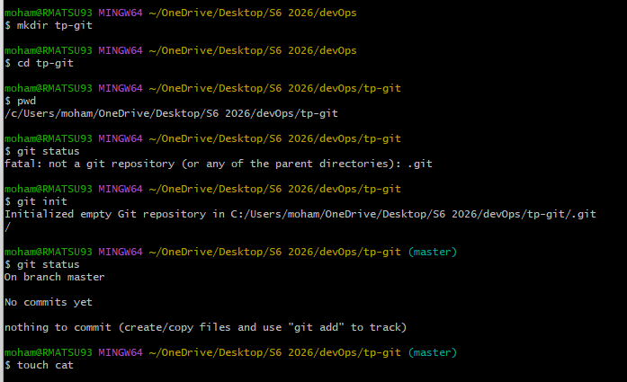
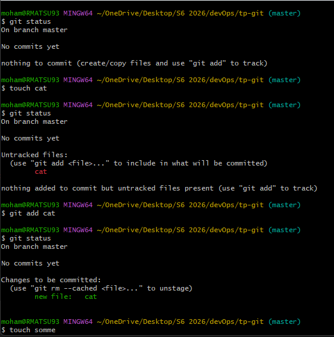
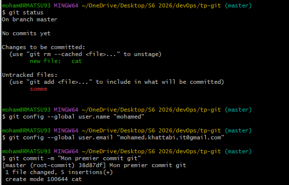
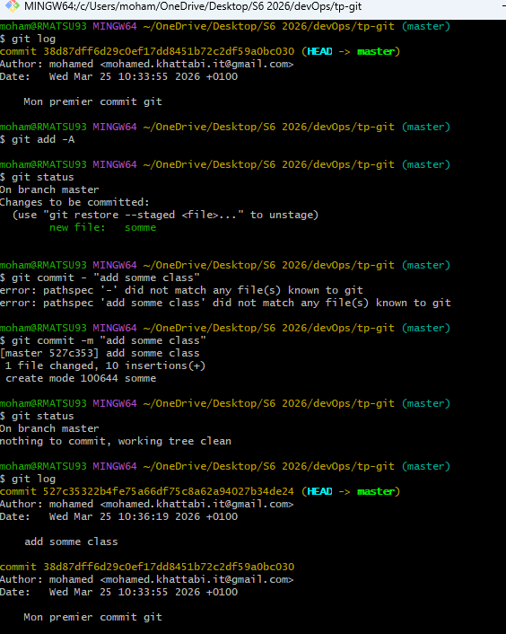
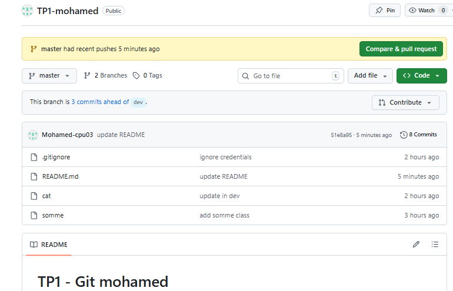
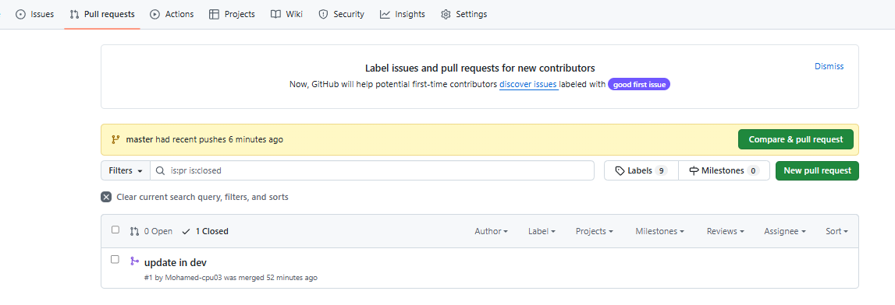

# TP1 - Git mohamed

## les etapes realisees 

# 1. initialisation de dépôt 
- creation du dossier
- initialisation avec git init

# 2. gestion des fichiers
- Ajout des fichiers cat, somme
- Suivi des fichiers avec git add
- Verification avec git status

# 3. commit
- premier commmit
- Ajout d'autres fichiers
-Historique avec git log

# 4. Gestion des credentials
- Creation du fichier credentials
- Suppression avec git rm
- Ajout de .gitignore pour ignorer credentials

# 5. branching
- creation de la branche dev
-modification et commit dans dev

# 6. gitHub
-creation de la reository TP1-mohamed
- pushe des branches 
- creation d'un pull request
- merge de dev vers master

# captures d'ecran  
- ci-dessous

## 📸 Screenshots

## autheur
Mohamed khattabi
